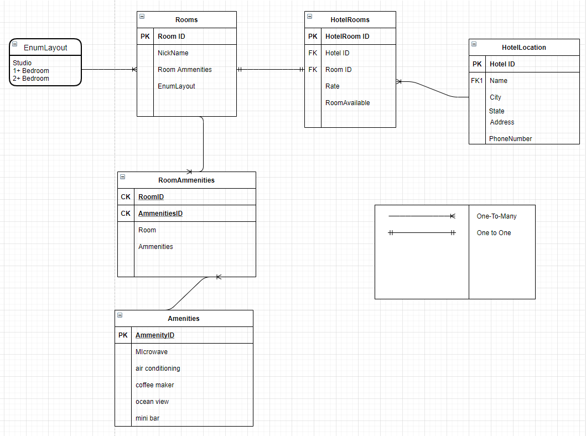

#  Async-Inn

**Author**: Michael Falk
**ERD Authors**: Matthew Petersen, David Dicken and Michael Falk

**Version**: 3.0 - 1/27/2021

## Overview
**version 3 update:** 
refactored code to include interfaces and services to handle database CRUD operations through table specific repositories. 

Before

Controller <==> DataBase

After

Controller <==> Repository <==> Database.

**Version 2 update:** 
Built tables into an entity framework database from our ERD.

Tables built:
Hotel
Room
Amenities

Tables have been seeded with data for 3 hotels, 3 rooms, and 3 ammenities.

ERD for our Async-Inn. 

1. Hotels have a Many:1 relationship with HotelRooms. (One hotel has many rooms)
2. HotelRoom has a 1:1 relationship with Rooms. (HotelRooms have a 1:1 with rooms because they have unique ID's)
3. We utilize an enum for our room layout, which has a 1:Many relationship. (one layout can belong to many rooms)
4. Rooms has a 1:Many relationship to RoomAmmenities. (One room may have many roomammenities)
5. Amenities has a Many:1 relationship with RoomAmmenities. (A room's ammenities can have many ammenities)

Join table is our RoomAmmenities. It joins a RoomID to AmmenitiesID.

